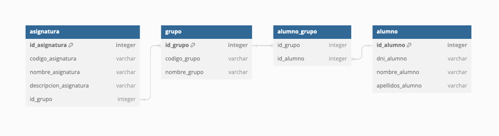
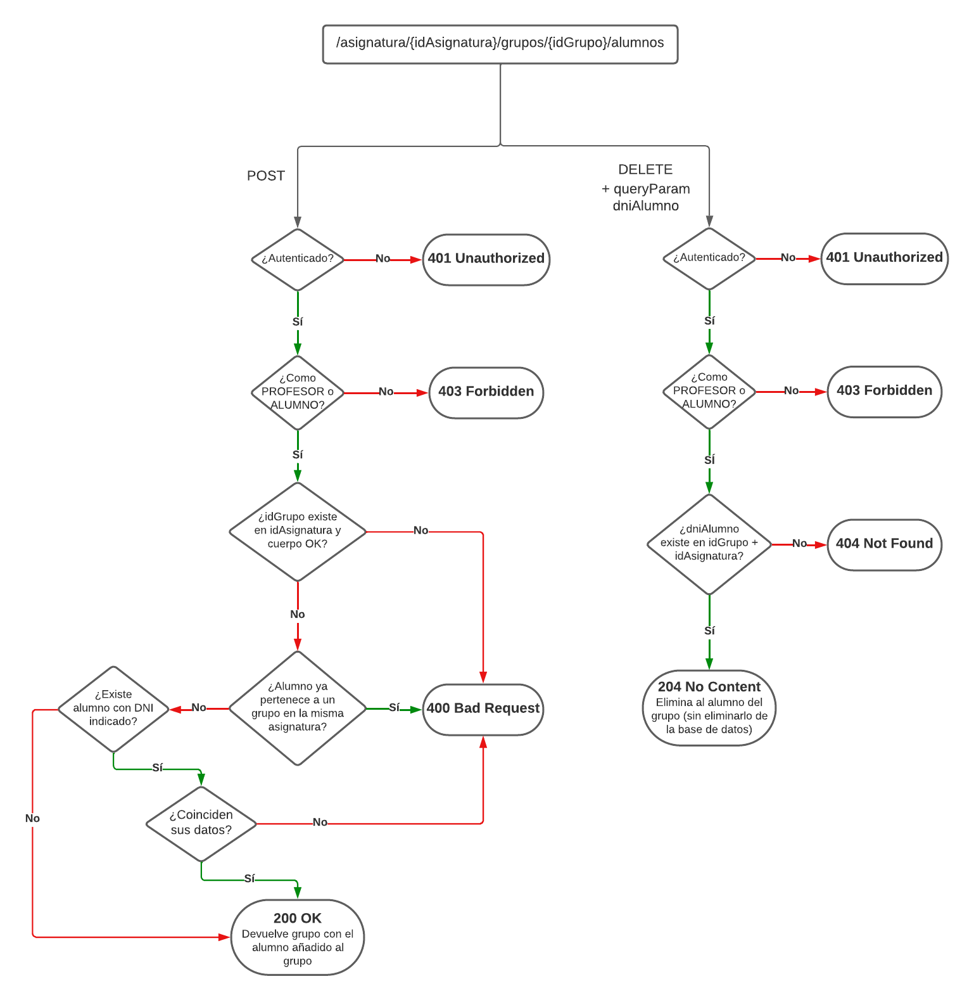

[](https://www.ticarum.es)

# Grupos de Prácticas - Universidad de Murcia

#### API para la gestión de grupos de prácticas en asignaturas de la Universidad de Murcia

_Desarrollada por **Salva Roca** para TICARUM_

## Descripción

Esta API REST desarrollada en `Spring Boot 2.7.18` y `Java 11` permite la gestión de grupos de prácticas de asignaturas
en
el
sistema de gestión educativa de la Universidad de Murcia. Permite diversas operaciones CRUD siguiendo los requisitos de
diseño planteados para las entidades que componen el sistema: Asignaturas, Grupos y Alumnos.

Se ha implementado `Spring Security 5.8.9` para la autenticación y autorización de usuarios, lo que además aporta una
capa de protección adicional contra amenazas comunes como SQLi, XSS o CSRF. 

La aplicación utiliza una base de datos H2 en memoria, por lo que la información persiste mientras la aplicación esté
en ejecución. Las operaciones de lectura y escritura se realizan mediante ORM a través de Hibernate con Spring Data JPA.
El modelo de datos sigue el diagrama mostrado a continuación:


La aplicación cuenta con tests unitarios para todos los métodos de los controladores, de forma que se puede probar la
implementación. Los métodos de los controladores con `Swagger OpenAPI`, al que se recomienda acceder desde 
http://localhost:8080/swagger-ui con las credenciales de `profesor` para realizar pruebas de cada endpoint. Estas 
pruebas se pueden realizar más cómodamente con la [colección de Postman](grupos-practicas.postman_collection.json) presente en el proyecto y accesible en el
siguiente botón:

[](https://app.getpostman.com/run-collection/24695878-2c982b7c-7096-43c1-861d-7629e43f17c4?action=collection%2Ffork&source=rip_markdown&collection-url=entityId%3D24695878-2c982b7c-7096-43c1-861d-7629e43f17c4%26entityType%3Dcollection%26workspaceId%3Dbcc164f4-70ef-4288-b5c5-34c63e8c45f0)

## Guía rápida

### Requisitos del sistema
* Java Development Kit (JDK) 11 o superior
* Maven 3.8.4 o superior
* IDE de desarrollo en Java (recomendado IntelliJ IDEA 2021.2.3 o superior)
* Cliente de API REST (recomendado Postman 9.0.7 o superior)

### Acceso a la API

Para acceder a la API, lanzar la aplicación y entrar en http://localhost:8080. Existen dos niveles de acceso a la API:

* Profesor: tiene permisos para realizar todas las operaciones CRUD sobre todos los endpoints, puede autenticarse con
  las siguientes credenciales de prueba:
  * usuario: `profesor`
  * contraseña `profesor1234`.
* Alumno: tiene permisos realizar operaciones de lectura sobre todas las entidades, y de escritura sólo sobre los 
  endpoints `/grupos/{idGrupo}/alumnos` y `/alumnos`. Puede autenticarse con las siguientes credenciales de prueba:
  * usuario: `alumno`
  * contraseña `alumno1234`.

Para facilitar las pruebas, en la colección de Postman se incluye una carpeta por cada tipo de usuario con las 
credenciales de prueba ya establecidas (sin autenticar, profesor y alumno).

### Detalle de Endpoints, Métodos y Respuestas

La API cuenta con los endpoints listados a continuación, y como norma general, todos los métodos devolverán los 
siguientes errores:

* `401 Unauthorized`: si el usuario no está autenticado.
* `403 Forbidden`: si el usuario no tiene permisos para realizar la operación.
* `500 Internal Server Error`: si se produce un error interno en el servidor.

#### Asignaturas `/asignaturas/{idAsignatura}`


* `GET`: permite obtener la asignatura con el ID `idAsignatura`, incluyendo todos sus grupos y alumnos.
  * Cuerpo del mensaje: vacío.
  * Respuestas:
      * `200 OK`: si existe una asignatura con ID `ìdAsignatura`, devuelve los detalles de dicha asignatura, los
        grupos y los alumnos de cada grupo en un JSON con el siguiente formato:
    ```json
    {
      "codigoAsignatura": "string",
      "nombreAsignatura": "string",
      "grupos": [{
        "codigoGrupo": "string",
        "alumnos": [{
        "nombre": "string",
        "apellidos": "string",
        "dni": "string"
        }]
      }]
    }
    ```

    * `404 Not Found`: si no existe ninguna asignatura con ID `ìdAsignatura`.
    
* `POST`: permite crear una nueva asignatura, siempre que no exista ninguna con el mismo `idAsignatura` o `codigoAsignatura`.
  * Cuerpo del mensaje:
    ```json
    {
      "codigoAsignatura": "string",
      "nombreAsignatura": "string",
      "descripcionAsignatura": "string"
    }
    ```
  * Respuestas:
    * `201 Created`: si se crea la asignatura correctamente, devuelve los detalles de la asignatura creada en un
      JSON con el siguiente formato:
      ```json
      {
        "idAsignatura": "integer",
        "codigoAsignatura": "string",
        "nombreAsignatura": "string",
        "descripcionAsignatura": "string",
        "grupos": null
      }
      ```
    * `400 Bad Request`: si no se proporcionan todos los parámetros necesarios para crear la asignatura o ya existe una 
      con el mismo `codigoAsignatura`.
    
* `PUT`: permite modificar una asignatura con el ID `idAsignatura`, sin permitir modificación parcial (sólo pueden
  modificarse `nombreAsignatura` y `descripcionAsignatura` simultáneamente).
  * Cuerpo del mensaje:
    ```json
    {
      "nombreAsignatura": "string",
      "descripcionAsignatura": "string"
    }
    ```  

  * Respuestas:
    * `200 Created`: si se crea la asignatura correctamente, devuelve los detalles de la asignatura creada en un
      JSON con el siguiente formato:
    ```json
    {
    "idAsignatura": "integer",
    "codigoAsignatura": "string",
    "nombreAsignatura": "string",
    "grupos": null
    }
    ```
    * `400 Bad Request`: si no se proporcionan los parámetros necesarios para crear la asignatura (no se admite 
      modificación parcial).
    * `404 Not Found`: si no existe ninguna asignatura con ID `ìdAsignatura`.
    
* `DELETE`: permite eliminar una asignatura con el ID `idAsignatura`.
  * Cuerpo del mensaje: vacío.
  * Respuestas:
    * `204 No Content`: si se elimina la asignatura correctamente.
    * `404 Not Found`: si no existe ninguna asignatura con ID `ìdAsignatura`.

#### Grupos `/asignaturas/{idAsignatura}/grupos/{idGrupo}`


* `GET`: permite obtener el grupo con el ID `idGrupo` en la asignatura con ID `ìdAsignatura`, incluyendo todos sus 
  alumnos.
  * Cuerpo del mensaje: vacío.
  * Respuestas:
    * `200 OK`: si existe un grupo con ID `ìdGrupo` en la asignatura con ID `ìdAsignatura`, devuelve los detalles de
      dicho grupo y los alumnos del mismo en un JSON con el siguiente formato:
    ```json
    {
      "idGrupo": "integer",
      "codigoGrupo": "string",
      "nombreGrupo": "string",
      "alumnos": [{
        "idAlumno": "integer",
        "dniAlumno": "string",
        "nombreAlumno": "string",
        "apellidosAlumno": "string"
      }]
    }
    ```
    * `404 Not Found`: si no existe ningún grupo con ID `ìdGrupo` en la asignatura con ID `ìdAsignatura`.
    
* `POST`: permite crear un nuevo grupo en la asignatura con ID `ìdAsignatura`, siempre que se cumplan las siguientes 
  condiciones: 
  - No existe ningún grupo con el mismo `idGrupo`ni `codigoGrupo`
  - No existen 5 grupos registrados en dicha asignatura.
  * Cuerpo del mensaje:
    ```json
    {
      "codigoGrupo": "string",
      "nombreGrupo": "string"
    }
    ```
  * Respuestas:
    * `201 Created`: si se crea el grupo correctamente, devuelve los detalles del grupo creado en un JSON con el
      siguiente formato:
    ```json
    {
      "idGrupo": "integer",
      "codigoGrupo": "string",
      "nombreGrupo": "string",
      "alumnos": null
    }
    ```
    * `400 Bad Request`: si no se proporcionan todos los parámetros necesarios para crear el grupo, no existe ninguna 
      asignatura con ID `ìdAsignatura`, ya existe un grupo con el mismo `codigoGrupo` o ya existen 5 grupos en dicha
      asignatura.
* `PUT`: permite modificar el `nombreGrupo`un grupo con el ID `idGrupo` en la asignatura con ID `ìdAsignatura`, sin
  afectar a los alumnos del mismo. 
  * Cuerpo del mensaje:
    ```json
    {
      "nombreGrupo": "string"
    }
    ```
  * Respuestas:
    * `200 Created`: si se modifica el grupo correctamente, devuelve los detalles del grupo creado en un JSON con el
      siguiente formato:
    ```json
    {
      "idGrupo": "integer",
      "codigoGrupo": "string",
      "nombreGrupo": "string",
      "alumnos": [{
        "idAlumno": "integer",
        "dniAlumno": "string",
        "nombreAlumno": "string",
        "apellidosAlumno": "string"
      }]
    }
    ```
    * `400 Bad Request`: si no se proporcionan el parámetro necesario para modificar el grupo.
    * `404 Not Found`: si no existe ningún grupo con ID `ìdGrupo` en la asignatura con ID `ìdAsignatura`.



* `POST /alumnos`: permite añadir un alumno al grupo con ID `idGrupo` en la asignatura con ID `ìdAsignatura`. Observaciones:
  - No se permite que un alumno esté en dos grupos dentro de la misma asignatura.
  - Si no se encuentra un alumno con el `dniAlumno` indicado en la base de datos, se crea un nuevo registro con los 
    datos proporcionados.
  - Si se encuentra un alumno con el `dniAlumno` indicado en la base de datos, se comprueba que los datos proporcionados
    coinciden con los del registro existente para evitar inconsistencias.
  * Cuerpo del mensaje:
    ```json
    {
      "dniAlumno": "string",
      "nombreAlumno": "string",
      "apellidosAlumno": "string"
    }
    ```
  * Respuestas:
    * `200 OK`: si añade al alumno correctamente al grupo (bien lo haya creado o bien haya verificado que la 
      información del alumno coincide con un registro existente), devuelve los detalles del grupo actualizado en un JSON
      con el siguiente formato:
    ```json
    {
      "idGrupo": "integer",
      "codigoGrupo": "string",
      "nombreGrupo": "string",
      "alumnos": [{
        "idAlumno": "integer",
        "dniAlumno": "string",
        "nombreAlumno": "string",
        "apellidosAlumno": "string"
      }]
    }
    ```
    * `400 Bad Request`: si no se proporcionan todos los parámetros necesarios para añadir al alumno, ya existe un 
      alumno registrado con dicho DNI pero sus datos no coinciden, o no existe ningún grupo con ID `ìdGrupo` en la 
      asignatura con ID `ìdAsignatura`.
      
* `DELETE /alumnos?dniAlumno={dniAlumno}`: permite eliminar un alumno del grupo con ID `idGrupo` en la asignatura con `idAsignatura`.
  * Cuerpo del mensaje: vacío.
  * Respuestas:
    * `204 No Content`: si elimina al alumno correctamente del grupo.
    * `404 Not Found`: si no existe ningún alumno con DNI `dniAlumno` en el grupo con ID `ìdGrupo` en la asignatura con 
      ID `ìdAsignatura`.

### Alumnos `/alumnos`


* `GET`: permite obtener una lista con todos los alumnos registrados.
  * Cuerpo del mensaje: vacío.
  * Respuestas:
    * `200 OK`: devuelve todos los alumnos registrados en un JSON con el siguiente formato:
    ```json
    [{
      "idAlumno": "integer",
      "dniAlumno": "string",
      "nombreAlumno": "string",
      "apellidosAlumno": "string",
      "grupos": [{
        "idGrupo": "integer",
        "codigoGrupo": "string",
        "nombreGrupo": "string",
          "asignatura": {
          "idAsignatura": "integer",
          "codigoAsignatura": "string",
          "nombreAsignatura": "string",
          "descripcionAsignatura": "string"
        }
      }]
    }]
    ```
    * `204 No Content`: si no hay ningún alumno registrado.
    
* `GET /{idAlumno}`: permite obtener los detalles de un alumno con ID `idAlumno`.
  * Cuerpo del mensaje: vacío.
  * Respuestas:
    * `200 OK`: si existe un alumno con ID `idAlumno`, devuelve los detalles de dicho alumno en un JSON con el
      siguiente formato:
    ```json
    {
      "idAlumno": "integer",
      "dniAlumno": "string",
      "nombreAlumno": "string",
      "apellidosAlumno": "string",
      "grupos": [{
        "idGrupo": "integer",
        "codigoGrupo": "string",
        "nombreGrupo": "string",
          "asignatura": {
            "idAsignatura": "integer",
            "codigoAsignatura": "string",
            "nombreAsignatura": "string",
            "descripcionAsignatura": "string"
          }
      }]
    }
    ```
    * `404 Not Found`: si no existe ningún alumno con ID `idAlumno`.
    
* `POST`: permite crear un nuevo alumno, siempre que no exista ningún alumno con el mismo `dniAlumno`.
  * Cuerpo del mensaje:
    ```json
    {
      "dniAlumno": "string",
      "nombreAlumno": "string",
      "apellidosAlumno": "string"
    }
    ```
  * Respuestas:
    * `201 Created`: si se crea el alumno correctamente, devuelve los detalles del alumno creado en un JSON con el
      siguiente formato:
    ```json
    {
      "dniAlumno": "string",
      "nombreAlumno": "string",
      "apellidosAlumno": "string",
      "grupos": "null"
    }
    ```
    * `400 Bad Request`: si no se proporcionan todos los parámetros necesarios para crear el alumno o ya existe un 
      alumno registrado con dicho DNI.

### Propuestas de Mejora

A continuación, se lista una serie de posibles mejoras que se podrían implementar en futuras versiones de la aplicación:
* Migrar a Java 17 (LTS) y Spring Boot 3 (última versión), incluyendo la última versión de Spring Security para mejorar 
  la seguridad de la aplicación.
* Permitir operaciones de eliminación específicas para las entidades Grupo y Alumno.
* No generar manualmente los IDs de las entidades Asignatura y Grupo, sino que se generen automáticamente, para mejorar
  la integridad de los datos.
* Permitir la modificación de los alumnos de un grupo.
* Permitir la modificación de los grupos de una asignatura.
